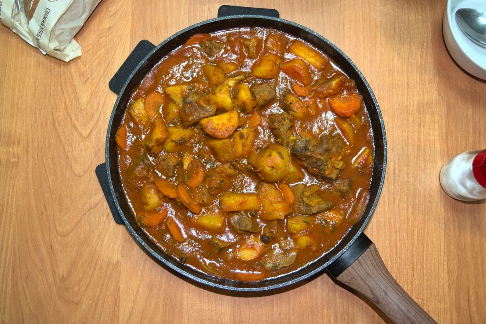

+++
title = "Beef Goulash"
date = 2021-03-07T20:07:00Z
[extra]
author ="Yaroslav de la Peña Smirnov <yps[at]yaroslavps.com>"
website = "https://www.yaroslavps.com/"
donate = "https://www.yaroslavps.com/donate/"
+++

This recipe requires a bigger set of ingredients than usual - mostly herbs and
spices - and it takes quite some time to prepare - about 1hr 30 minutes.
However, it is actually quite easy to make, and it is a really hearty and
delicious recipe, if I do say so myself.

<!-- more -->

## Ingredients

The ingredients here are for about 2-3 portions, depending on your appetite:

* 500g beef
* 300-400g potatoes
* 1 carrot
* 1 medium onion
* 12 tablespoons tomato paste
* 500ml water
* 3-4 garlic cloves
* 3-4 bay leaves
* Curcuma
* Paprika
* Oregano
* Parsley
* Caraway
* Basil (optional)
* Cilantro (optional)
* 2-3 champignon mushrooms (optional)
* Salt
* Black pepper

## Instructions

1. Heat up the frying pan and add some oil.
2. Cut the potatoes into small pieces and fry them on the frying pan over
   medium-heat, add some salt.
3. Chop the onion.
4. Cut the beef into small enough pieces and dust with flour.
5. After about 15 minutes of frying the potatoes, add the onions and beef to the
   pan and fry for  another 10-15 minutes, or until brown.
6. While the beef, potatoes and onions are frying, cut the carrot and mushrooms,
   and chop the parsley and cilantro.
7. Once the beef is brown, add water to the pan, and add the rest of the
   ingredients, including salt, black pepper and herbs/spices to taste.
8. Mix thoroughly, cover the pan with a lid and stew for about 60-80 minutes
   over low-heat. While it is stewing, you can get back to doing some other
   things, like watching memes.
9. Remove from stove, serve hot and enjoy with some beer or cider (or your
   favorite beverage).

Originally published at [https://www.yaroslavps.com/food/beef-goulash/](https://www.yaroslavps.com/food/beef-goulash/)
