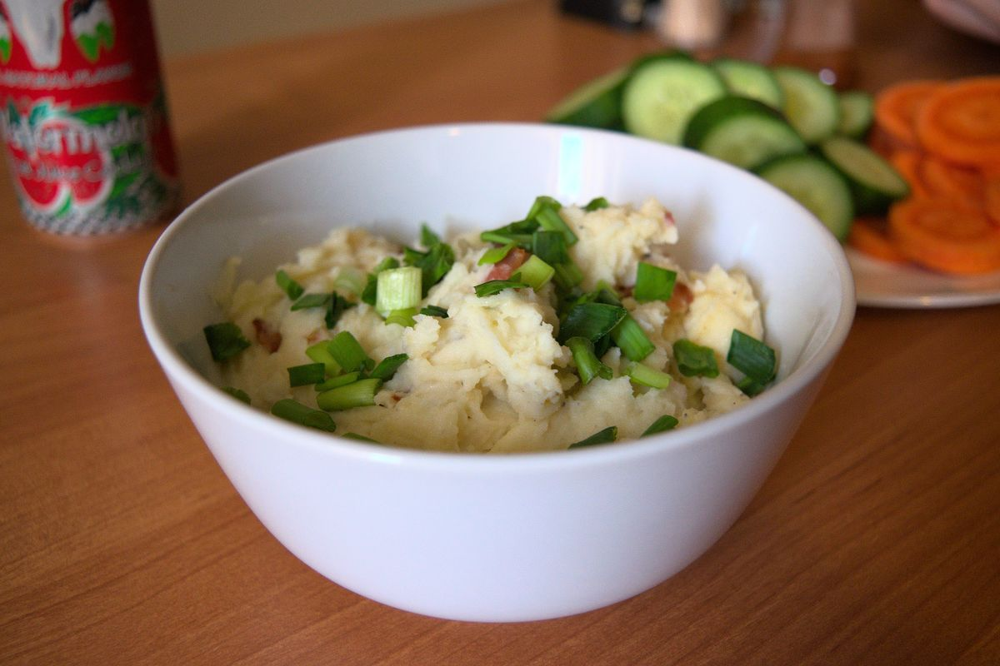

+++
title = "Cremoso Puré de Papas"
date = 2021-03-07T20:05:00Z
[extra]
author ="Yaroslav de la Peña Smirnov <yps[at]yaroslavps.com>"
website = "https://www.yaroslavps.com/"
donate = "https://www.yaroslavps.com/donate/"
updated = 2021-02-21T18:01:29Z
+++

El puré de papas es un plato que comúnmente se ve relegado al rol de guarnición.
Esta receta es una variación del clásico puré de papas, pero un tanto mejorada.
Puedes servir este plato como guarnición o comértelo por si sólo.

<!-- more -->

## Ingredientes

Las cantidades en esta lista son para 4 porciones adultas. O 6-8 porciones si
tienes planeado servirlo como guarnición.

* 1kg de papas
* 200ml de leche*
* 200ml de mayonesa*
* ~100g de queso rallado
* Ajo en polvo
* 12-16 tiras de tocino
* Mantequilla
* 3-4 tallos de cebollín
* Pimienta negra
* Sal

\*Éstas porciones en realidad dependen de que tan cremoso o seco quieras el puré.

## Instrucciones

1. Pela y corta las patatas en pedazos no muy pequeños.
2. Pon las patatas en una olla con suficiente agua para cubra las patatas y
   cócelas por aproximadamente 20-30 minutos, o hasta que estén blandas.
3. Unos 10 minutos antes de remover las patatas del agua, corta el tocino en
   pequeños trozos y fríelo.
4. Mezcla y calienta la leche con la mayonesa.
5. Ralla el queso.
6. Ya que las patatas estén listas, remueve el agua de la olla, agrega la mezcla
   caliente de leche y mayonesa, agrega algo de mantequilla y machaca las papas.
7. Agrega sal, pimienta y ajo en polvo al gusto y continúa machacando y
   mezclando.
8. Ya que el puré esté algo homogéneo con las papas suficientemente machadas,
   agrega el queso rallado y el tocino frito y mézclalos.
9. Sirve y agrega el cebollín picado encima.

Originalmente publicado en [https://www.yaroslavps.com/es/food/creamy-mashed-potatoes/](https://www.yaroslavps.com/es/food/creamy-mashed-potatoes/)
