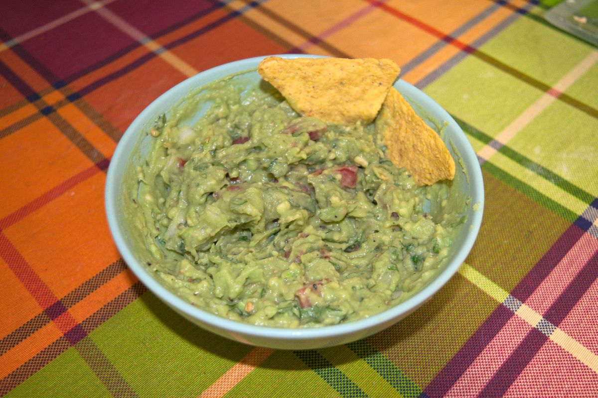

+++
title = "Fresh Guacamole"
date = 2021-03-07T20:08:00Z
[extra]
author ="Yaroslav de la Peña Smirnov <yps[at]yaroslavps.com>"
website = "https://www.yaroslavps.com/"
donate = "https://www.yaroslavps.com/donate/"
+++

A nice recipe that functions as a delicious and fresh appetizer, best eaten with
some totopos corn chips, especially in a hot summer day.

<!-- more -->

## Ingredients

Here are the ingredients for about two adult portions:

* 2 Hass avocados
* 1/4 medium onion
* 1 small tomato
* Cilantro
* 1 lime
* Salt
* Black pepper

And of course, some totopos to eat with.

## Instructions

1. Cut the avocados in half, open them and place the pulp in a bowl.
2. Mash the avocados, add lime juice, mix and mash some more.
3. Mince the cilantro, tomato and onion and add them to the avocado mix.
4. Add salt and black pepper to taste and mix thoroughly.
5. Enjoy fresh with some totopos!

This recipe is best consumed fresh, since the avocado oxidizes pretty fast and
might lose its appetizing color and texture in just some hours.

Originally published at [https://www.yaroslavps.com/food/fresh-guacamole/](https://www.yaroslavps.com/food/fresh-guacamole/)
