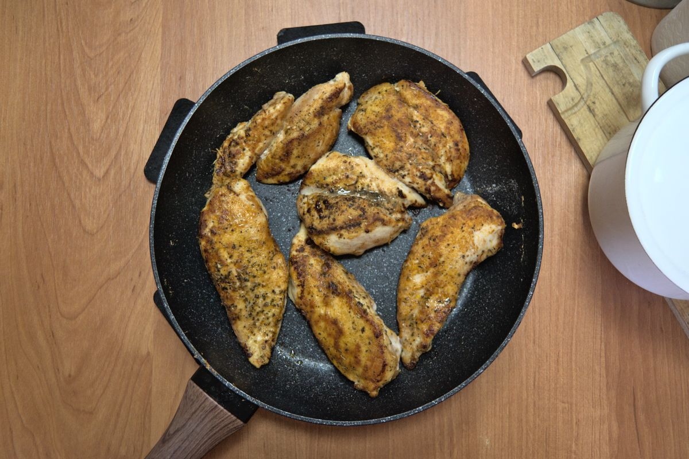

+++
title = "Jugoso Filete de Pollo Frito"
date = 2021-03-07T20:02:00Z
[extra]
author ="Yaroslav de la Peña Smirnov <yps[at]yaroslavps.com>"
website = "https://www.yaroslavps.com/"
donate = "https://www.yaroslavps.com/donate/"
+++

Esta es una rápida y fácil receta para preparar unos deliciosos filetes de pollo
crujientes por fuera, pero jugosos por dentro.

<!-- more -->

## Ingredientes

En esta receta no uso medidas exactas de los ingredientes. Es simplemente
cuestión de prepararla una vez para saber cuales son las porciones ideals para
los gustos de uno.

* Filetes de pollo; usualmente uso pechugas
* Harina de trigo
* Páprika en polvo
* Ajo en polvo
* Hierbas de Provenza
* Sal
* Pimienta negra

## Instrucciones

1. Enjuagar los filetes.
2. Remover el exceso de humedad/agua de los filetes cuidadosamente palmando los
   filetes con una toalla o servilleta.
3. Si los filetes están muy gruesos, cortarlos a la mitad.
4. En un pequeño contenedor, poner suficiente harina y mezclar con la páprika,
   ajo en polvo, hierbas, pimienta recién molida y sal al gusto.
5. Agregar un poco de aceite de cocina a la sartén y calentarla a fuego
   medio-alto.
6. Cubrir los filetes rodándolos por la mezcla de harina y especias.
7. Ya que la sartén este caliente, poner los filetes en ella y freírlos por 5
   minutos de cada lado a fuego medio-alto.
8. Si al final resulta que los filetes estaban muy gruesos y no se cocinaron
   bien por dentro, tapa la sartén y cocínalos por 2-3 minutos más a fuego bajo.
9. Eso es todo amigos ¡Disfruten de su cena!

Originalmente publicado en [https://www.yaroslavps.com/es/food/pan-seared-chicken-filet/](https://www.yaroslavps.com/es/food/pan-seared-chicken-filet/)
