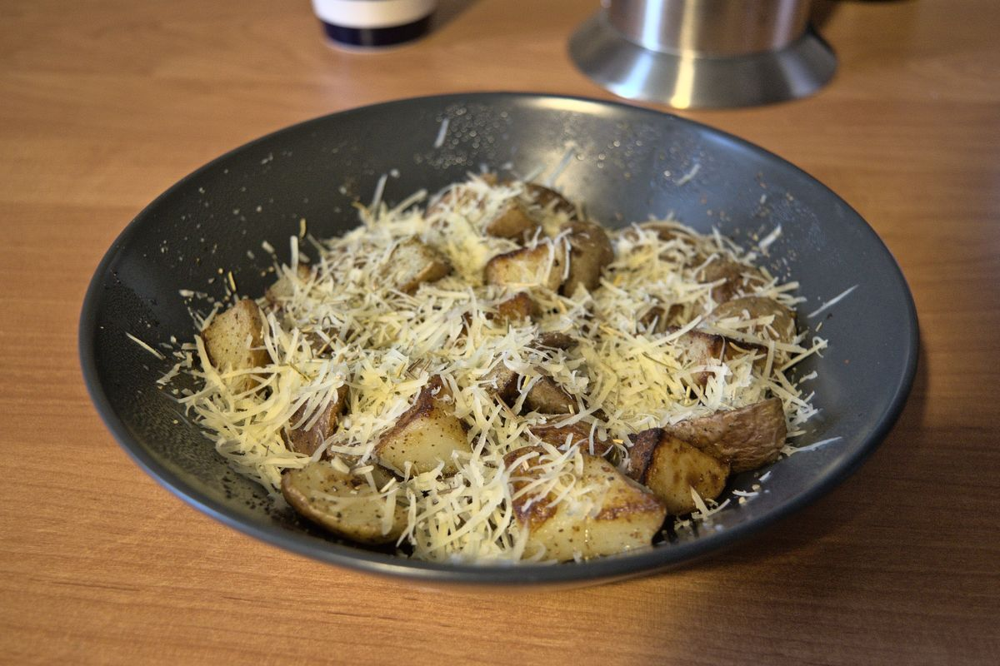

+++
title = "Patatas parmesanas"
date = 2021-03-07T20:03:00Z
[extra]
author ="Yaroslav de la Peña Smirnov <yps[at]yaroslavps.com>"
website = "https://www.yaroslavps.com/"
donate = "https://www.yaroslavps.com/donate/"
updated = 2021-02-21T14:34:43Z
+++

Una receta fácil y rápida de preparar (creo que lo digo cada vez). Yo la como
tanto a veces guarnición, o a veces desayuno. Pero vaya, la puedes comer como
quieras.

<!-- more -->

## Ingredients

Como ya se pueden imaginar, esta receta no requiere de muchos ingredientes.
Estas medidas son para un estudiante hambriento, o dos personas si la quieren
como guarnición.

* 2-3 patatas medias
* Mantequilla
* Parmesano
* Romero; puedes usar romero seco, pero fresco es mejor
* Sal
* Pimienta negra

## Instrucciones

1. Parte las papas en cubos pequeños.
2. Agrega mantequilla a la sartén y caliéntala.
3. Agrega las patatas a la sartén, agrégales sal, y fríelas a fuego medio por
   unos 20 minutos, moviendo las papas de vez en cuando.
4. Unos 3-5 minutos antes de quitar las papas del fuego, agrega unas hojas de
   romero a las papas y revuélvelas.
5. Quita las papás de la sartén, sírvelas y agrega algo de parmesano recién
   rallado y pimienta recién molida.
6. ¡Buen provecho!

Originalmente publicado en [https://www.yaroslavps.com/es/food/parmesan-potatoes/](https://www.yaroslavps.com/es/food/parmesan-potatoes/)
