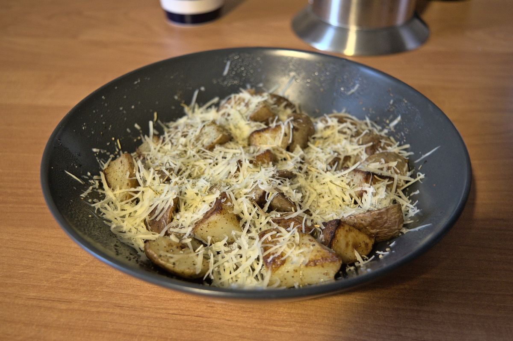

+++
title = "Parmesan potatoes"
date = 2021-03-07T20:03:00Z
[extra]
author ="Yaroslav de la Peña Smirnov <yps[at]yaroslavps.com>"
website = "https://www.yaroslavps.com/"
donate = "https://www.yaroslavps.com/donate/"
updated = 2021-02-21T14:34:43Z
+++

A recipe that's easy and fast to prepare (I think I've said this too many times
already). You can have this as a side dish, or for breakfast. Well, you can have
it whenever and wherever you want if you are cooking it! We are grown ups here
after all.

<!-- more -->

## Ingredients

As you can already probably imagine, this dish doesn't require a lot of
ingredients. The quantities are for one average hungry student. If you want to
have it as a side dish this should be enough for two persons.

* 2-3 medium-sized potatoes
* Butter
* Parmesan cheese
* Rosemary; dried should be fine, but fresh is obviously better
* Salt
* Black pepper

## Instructions

1. Cut the potatoes into small cubes.
2. Add some butter to a frying pan and heat up.
3. Add potatoes to frying pan, salt them and fry over medium heat for about
   20 minutes moving the potatoes from time to time.
4. About 3-5 minutes before removing the potatoes from the heat, add some
   rosemary leaves a stir the potatoes.
5. Remove potatoes from pan, serve and add shredded Parmesan and some freshly
   ground pepper on top.
6. Enjoy!

Originally published at [https://www.yaroslavps.com/food/parmesan-potatoes/](https://www.yaroslavps.com/food/parmesan-potatoes/)
