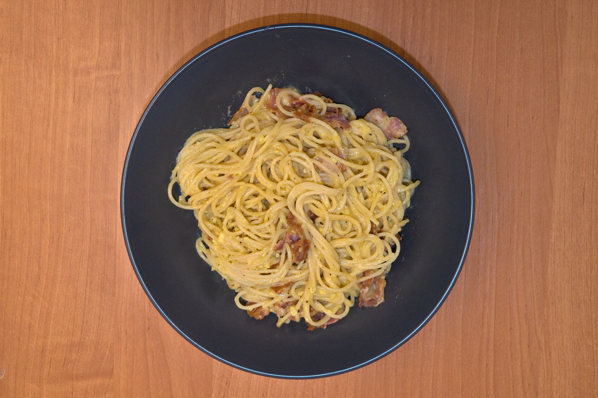

+++
title = "Espagueti a la carbonara"
date = 2021-03-07T20:00:00Z
[extra]
author ="Yaroslav de la Peña Smirnov <yps[at]yaroslavps.com>"
website = "https://www.yaroslavps.com/"
donate = "https://www.yaroslavps.com/donate/"
+++

No conozco muchas recetas de pasta, pero ésta es definitivamente una de mis
favoritas. No hacen falta muchos ingredientes y es bastante fácil y rápido de
cocinar. Claro está, que esta no es la "original" o "auténtica" carbonara,
empero mi propia versión a mi gusto. Sea como sea, considero que esta receta es
bastante deliciosa.

<!-- more -->

La mayor diferencia es que la receta original usa pancetta, que es un tipo de
carne curada típica de Italia. Pero como nadie vende eso por donde vivo, yo uso
tocino, sin mencionar que me encanta el tocino. También le agrego algo de crema
agria a la mezcla de huevos para darle una consistencia más cremosa, pero no es
completamente necesaria.

## Ingredientes

Esta es la lista de ingredientes para aproximadamente dos porciones adultas.

* 5 yemas de huevo
* 250g de espagueti
* 6-8 tiras de tocino
* ½ - 1 cucharada de crema agria (opcional)
* Parmesano al gusto
* Sal
* Pimienta negra recién molida
* Aceite de oliva

## Instrucciones

1. Hierve algo de agua en una cazuela y agrégale sal. Después de que empiece a
   hervir, agrega el espagueti y cocina al dente.
2. Cortar las tiras de tocino en trozos y fríelos en una sartén a fuego medio.
3. Mientras se cocinan el tocino y el espagueti, prepara la salsa. Bate las
   yemas en un plato hondo y agregale la crema. Agrega sal y pimienta al gusto.
   Raya el parmesano y agrégalo a la mezcla. La cantidad de parmesano depende de
   tus gustos, usualmente le agrego la mitad del volumen de la mezcla de yemas,
   o en otras palabras — bastante.
4. Una vez que el espagueti esté listo, cuélalo, agrega algo de aceite de olivo
   a la sartén con el tocino, y agrega el espagueti a la sartén. Saltea
   aproxima denté unos tres minutos a fuego medio-bajo.
5. Apaga el fuego y agrega la salsa de yemas de huevo y parmesano a la sartén y
   revuelve vigorosamente.
6. ¡Sirve y disfruta!

Originalmente publicado en [https://www.yaroslavps.com/es/food/spaghetti-alla-carbonara/](https://www.yaroslavps.com/es/food/spaghetti-alla-carbonara/)
