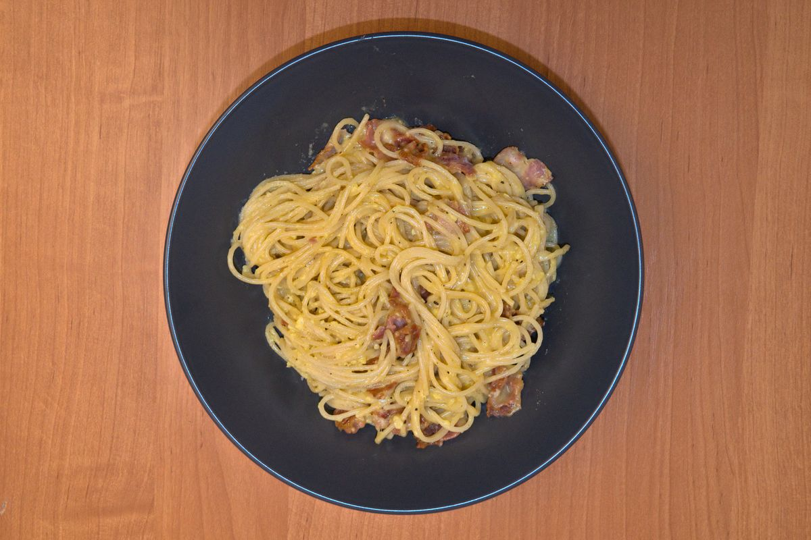

+++
title = "Спагетти алла карбонара"
date = 2021-03-07T20:00:00Z
[extra]
author ="Yaroslav de la Peña Smirnov <yps[at]yaroslavps.com>"
website = "https://www.yaroslavps.com/"
donate = "https://www.yaroslavps.com/donate/"
+++

Я не умею готовить очень много рецептов макарон или спагетти, но этот рецепт
однозначно один из моих любимых. Его довольно быстро и легко приготовить и не
нужно покупать куча ингредиентов. Конечно, это не оригинальная рецептура, а моя
версия рецепта настроенный под мои вкусы. Всё-равно считаю что он очень вкусный.

<!-- more -->

Основное отличие между этим и оригинальным рецептом заключается в том, что в
оригинальном используется панчетта — мясной продукт итальянской кухни. Однако,
как вы наверное могли догадаться, его не продают там где я живу, а поэтому
пришлось его заменить беконом. К тому же я очень сильно люблю бекон. Также я
добавляю немного сметаны в соус чтобы сделать его более густым и сливочным, но
её можно не добавлять.

## Ингредиенты

Здесь список ингредиентов примерно на две взрослые порции.

* 5 яичных желтков
* 250g спагетти
* 6-8 кусков бекона
* ½ - 1 столовых ложек сметаны (на вкус)
* Пармезан
* Соль
* Чёрный перец
* Оливковое масло

## Инструкции

1. Вскипятите немного воды в кастрюле и добавьте соли. Как только вода будет
   кипеть, добавьте макароны.
2. Порежьте бекон в более мелкие куски и жарьте в сковородке на среднем огне.
3. Пока спагетти и бекон готовятся, приготовьте соус. Взбейте желтки в глубокой
   тарелке и добавьте сметаны. Добавьте соль и перец на вкус. Протрите пармезан
   и добавьте в смесь. Сколько пармезана добавить будет зависеть от ваших
   вкусовых предпочтений. Я обычно добавляю примерно половина объёма соуса, то
   есть, щедро.
4. Как только спагетти будет готово, слейте воду, добавьте оливковое масло в
   сковородку с беконом, затем добавьте спагетти в сковородку. Жарьте на низком
   огне примерно 3 минуты постоянно перемешивая.
5. Выключите огонь (важно!) и затем добавьте соус в сковородку и тщательно
   перемешиваете.
6. Наслаждайтесь готовым блюдом!

Впервые опубликовано в [https://www.yaroslavps.com/ru/food/spaghetti-alla-carbonara/](https://www.yaroslavps.com/ru/food/spaghetti-alla-carbonara/)
