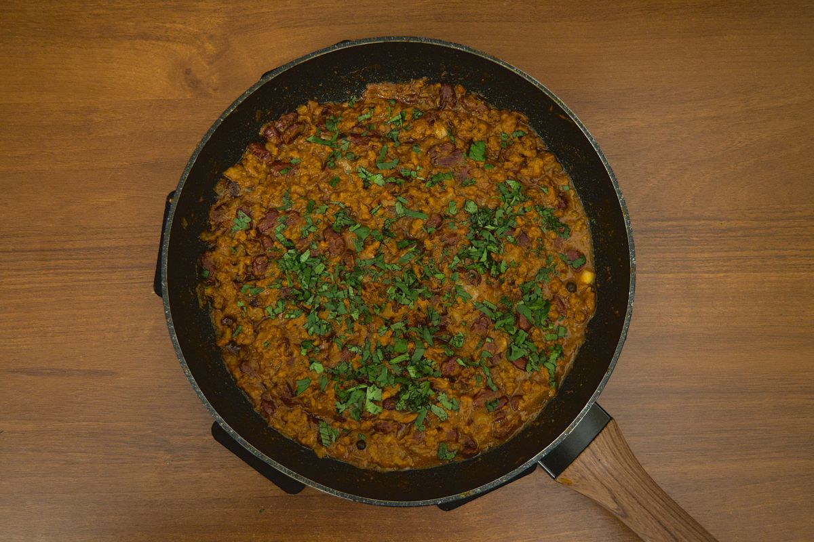

+++
title = "Spicy Chili con Carne"
date = 2021-03-07T20:11:00Z
[extra]
author ="Yaroslav de la Peña Smirnov <yps[at]yaroslavps.com>"
website = "https://www.yaroslavps.com/"
donate = "https://www.yaroslavps.com/donate/"
+++

This recipe is for those who like their food a little spicy. A classic of
Tex-Mex cuisine, although its true origins are disputed.<!-- more -->[^1]

## Ingredients

Here are the ingredients for 2-4 adult portions, depending on your appetite:

* 400g ground beef
* 400g can of pre-cooked beans
* 1 onion
* 3-4 garlic cloves
* 10-12 spoonfuls tomato paste
* ~150ml water
* Whole black peppercorns, or even better, allspice[^2]
* Chili powder[^3]
* Cumin[^2]
* Oregano[^2]
* Salt[^2]
* Cooking oil (preferably olive oil)
* 3-4 Basil leaves (optional)
* Cilantro (optional)
* Worcestershire sauce (optional)[^2]

## Instructions

1. Add oil to a deep frying pan, or a sauce pan, and heat to medium heat.
2. Chop the onions and add them to the heated pan.
3. After frying the onions for a bit, add the ground beef and fry it until it is
   well-done; salt the beef to taste.
4. Just before the beef is done, mince or grate the garlic cloves and add it to
   the pan.
5. Add the water, beans and tomato paste and mix.
6. Add chili powder, oregano, cumin, allspice/peppercorns and a little bit more
   salt to the pan and mix thoroughly; also add the basil leaves and
   Worcestershire sauce if you want to add a little more flavor.
7. Once the mix is boiling, cover the pan, and stew at low heat for about 45-60
   minutes.
8. Once the chili is quite thick (but not too dry!), it should be done; or maybe
   you prefer it a little bit more soup-y.
9. You can also add some freshly chopped cilantro on top to add even more
   flavor.

## How to eat

So, this might be strange, to tell somebody how to eat some food, but I gather
there's multitude different ways to eat chili. The most obvious one, is to just
eat it as it is with a spoon, or maybe with some totopos. I, however, like to
make some burritos stuffed with the stuff, together with some grated cheese and
jalapeños. 

There's of course other dishes, like hot dogs with chili (a.k.a chilidogs),
sandwiches with chili, hamburgers with chili; you get the idea.

Originally published at [https://www.yaroslavps.com/food/spicy-chili-con-carne/](https://www.yaroslavps.com/food/spicy-chili-con-carne/)

[^1]: [Nobody Knows More About Chili Than I Do (Archived)](http://web.archive.org/web/20160303171627/http://www.chilicookoff.com/History/History_Started.asp)

[^2]: Add to taste.

[^3]: Especially chili powder, only you know how much spice you and your stomach
  can take.

