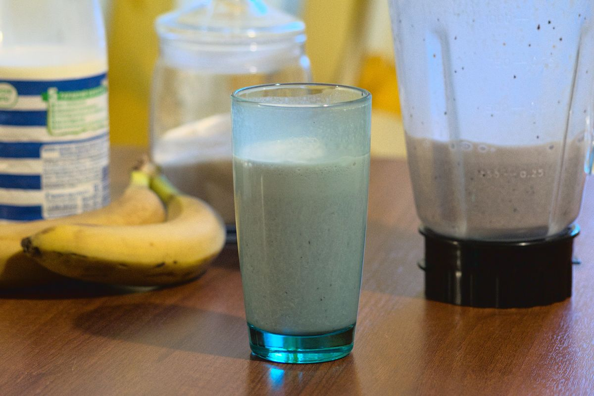

+++
title = "Malteada de Domingo por la Mañana"
date = 2021-03-07T20:12:00Z
[extra]
author ="Yaroslav de la Peña Smirnov <yps[at]yaroslavps.com>"
website = "https://www.yaroslavps.com/"
donate = "https://www.yaroslavps.com/donate/"
+++

Una dulce y refrescante malteada que no requiere de mucho esfuerzo para hacer.
No es que solo se pueda hacer los domingos, simplemente era casi una tradición o
costumbre en mi familia el prepararla los fines de semana, y a veces parece que
si que sabe mejor un sábado o domingo en la mañana. Además, necesitaba un mejor
título que simplemente "malteada".

<!-- more -->

## Ingredientes

Estos son los ingredientes para aproximadamente 4 vasos o 1 litro:

* 1 plátano (o 2 si son muy pequeñas)
* ~120 gramos de moras. Pueden ser las moras que quieres
* <1 litro de leche
* Vainilla
* Azúcar

## Instrucciones

1. Parte el plátano de tal forma que quepa mejor en la licuadora.
2. Agrega los pedazos de plátano, las moras, vainilla y azúcar al gusto a la
   licuadora. Usualmente le agrego unas 6 cucharaditas de azúcar.
3. Hecha suficiente leche para que la mezcla llene un litro del volumen de la
   licuadora.
4. Licua hasta que la mezcla se vea un tanto homogénea.
5. Sirve y disfruta!
5. Pour it and enjoy!

Casi cualquier comida es mejor consumida fresca, especialmente en el caso de
esta receta. Si dejas la malteada más de 10—15 minutos, se va a oxidar, y ya no
estará tan fresca ni deliciosa.

Originalmente publicado en [https://www.yaroslavps.com/es/food/sunday-morning-milkshake/](https://www.yaroslavps.com/es/food/sunday-morning-milkshake/)
