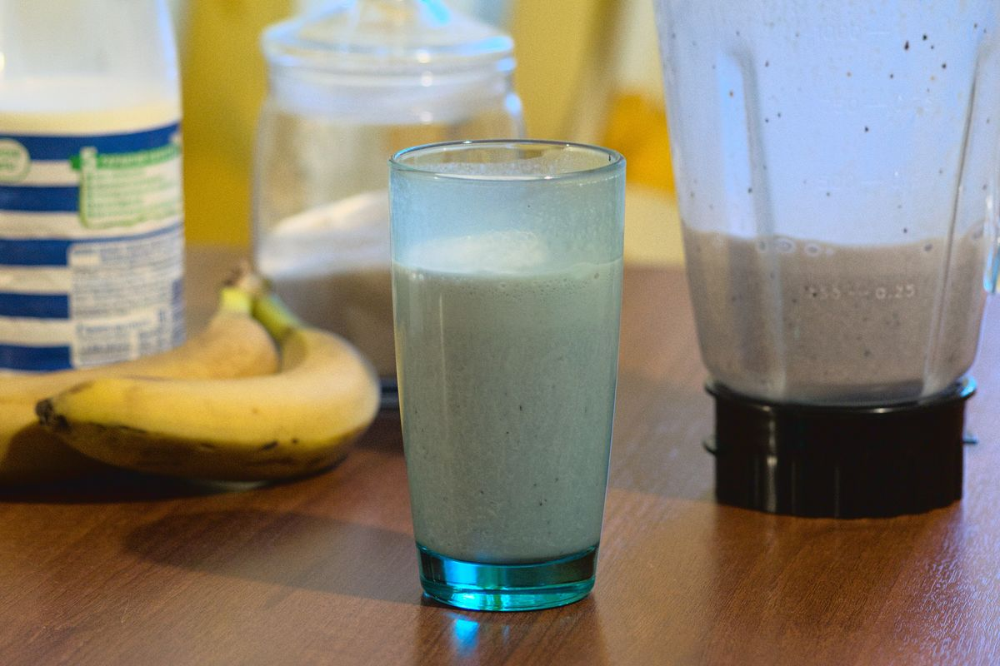

+++
title = "Утренний Молочный Коктейль"
date = 2021-03-07T20:12:00Z
[extra]
author ="Yaroslav de la Peña Smirnov <yps[at]yaroslavps.com>"
website = "https://www.yaroslavps.com/"
donate = "https://www.yaroslavps.com/donate/"
+++

Сладкий и освежающий молочный коктейль, который даже младенец может приготовить.
Обычно в семье мы их готовили утром субботы или воскресенья, но можно, кончено
же, его готовить в любой день и время.

<!-- more -->

## Ингредиенты

Список ингредиентов на 4 стакана, или литр:

* 1 банан (или 2 если они слишком маленькие)
* ~120 грамм ягод. Можно использовать любые ягоды.
* <1 литр молока.
* Ваниль
* Сахар

## Инструкции

1. Порежьте банан так, чтобы он поместился в блендер.
2. Добавьте куски банана, ягоды, ваниль и сахар на вкус в блендер. Обычно я
   добавляю примерно 6 чайных ложек сахара.
3. Налейте молока на столько чтобы все ингредиенты занимали литр объёма в чаше
   блендера.
4. Измельчите до тех пор пока смесь не выглядит более менее однородной.
5. Налейте и наслаждайтесь!

Конечно же, любую еду и напитки лучше употреблять свежими, но это особенно
касается этого рецепта. Если вы оставите коктейль больше чем на 10-15 минут, то
он окислиться и больше не будет таким же вкусным.

Впервые опубликовано в [https://www.yaroslavps.com/ru/food/sunday-morning-milkshake/](https://www.yaroslavps.com/ru/food/sunday-morning-milkshake/)
